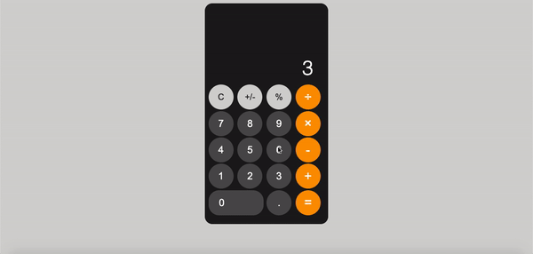

Here is a web app I built using vanilla JavaScript. It is a fully functional Iphone calculator built from scratch, all the way from HTML, through CSS, using custom properties and finally Javascript.

Feel free to test it out and leave feedback.

